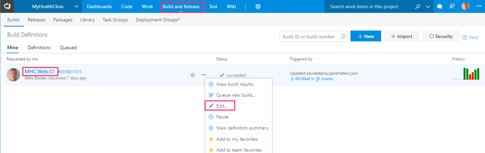

# DevOpsLab

This lab will step through the key elements in setting up a DevOps pipeline for Azure using the DevOps tools for Azure - Visual Studio Team Services (VSTS).

This lab is intended to provide a learning path through the [many existing VSTS labs](https://almvm.azurewebsites.net/), in order to focus on the core DevOps elements.

>Background information

>[What is DevOps?](https://www.visualstudio.com/learn/what-is-devops/)

>[How Microsoft does DevOps](https://www.visualstudio.com/learn/devops-at-microsoft/)

# Overall flow

- Preparing for the lab
- Working with Git
- Continuous Integration
- Create an Azure web app
- Continuous Deployment
- Infrastructure as Code
- Automated Testing with Selenium
- Monitoring with Application Insights

# Preparing for the lab

For this lab you will require:

- A Visual Studio Team Services account (free)
- An Azure subscription (your own or a free trial)
- Visual Studio 2017 installed (optional)

>VSTS supports any app and doesn't require the use of Visual Studio, .NET or other Microsoft languages. At the bottom of this page there are links to labs that work through implementing DevOps with Node, Java, Eclipse, IntelliJ and Docker.

1. Follow [these instructions (overview section)](http://almvm.azurewebsites.net/labs/vsts/) to set the above up.
2. Use the [VSTS Demo Generator](http://almvm.azurewebsites.net/labs/vsts/VSTSDemoGenerator/) to create a VSTS project using the My Health Clinic template. Call the project My Health Clinic or something similar.

>Optional: Create a new Dashboard in VSTS:
>- In your VSTS project, select Dashboard and then New:
>

>- Name the new Dashboard Lab Progress:
>

>- Select the pencil icon in the bottom left, followed by the plus button:
>

>- Search for and select the Markdown widget:
>

>- Configure the Markdown widget and add the names of your team and any other summary info that might be useful:
>

>- Save the changes, close the widget gallery and save the dashboard by clicking on the blue edit button in the bottom right hand corner.

# Lab 1: Working with Git

Having code and other artifacts under source control is a fundamental requirement. [This lab](http://almvm.azurewebsites.net/labs/vsts/git/) will introduce you to using Git in VSTS for source control. 

1. Complete [Exercise 1: Cloning a Git repository](http://almvm.azurewebsites.net/labs/vsts/git/#exercise-1-cloning-an-existing-repository) to ensure that you have the project cloned to Visual Studio.
2. Update the .gitignore file to reduce the number of files to commit to Git (broadly anything that is an output of compilation as this doesn't need putting in source control). In Visual Studio open the Team Explorer and select Settings.

3. Select Repository Settings.

4. Select Edit Ignore File.

5. Replace the (probably empty) .gitignore file contents with the generic [Visual Studio .gitignore file](https://github.com/github/gitignore/blob/master/VisualStudio.gitignore) (click the Raw button at the top of the file to get the plain text version to copy and paste). Save and close the file.

6. If you are new to Git then complete [Exercise 2: Save work with commits](http://almvm.azurewebsites.net/labs/vsts/git/#exercise-2-save-work-with-commits). Use the MHC_ASPNetCore solution and note that you will see more than one change in the initial commit, carry on including those alongside your own change.
7. Optionally complete:
- [Exercise 3: Review History](http://almvm.azurewebsites.net/labs/vsts/git/#exercise-3-review-history)
- [Exercise 4: Manage Branches from Visual Studio](http://almvm.azurewebsites.net/labs/vsts/git/#exercise-4-manage-branches-from-visual-studio)
- [Exercise 5: Manage branches from the Team Services Portal](http://almvm.azurewebsites.net/labs/vsts/git/#exercise-5-manage-branches-from-the-team-services-portal)
- [Exercise 6: Pull Requests](http://almvm.azurewebsites.net/labs/vsts/git/#exercise-6-pull-requests)
- [Exercise 7: Manage Repositories](http://almvm.azurewebsites.net/labs/vsts/git/#exercise-7-manage-repositories). 
>Optional: Add a Code Tile to your Lab Progress dashboard:
>- Add the Code Tile:
>

>- Configure the tile and make sure that the branch is master:
>

>- Save the changes, close the widget gallery and save the dashboard by clicking on the blue edit button in the bottom right hand corner.

# Lab 2: Continuous Integration

Continuous Integration is a key DevOps practice to build, test and create the software to later deploy.

1. Complete the [Continuous Integration Lab](http://almvm.azurewebsites.net/labs/vsts/continuousintegration/).
>Optional: Add a Build History widget to the Lab Progress dashboard by:
>- Searching for and adding the build history widget:
>

>- Ensuring that it is configured to the build definition created in the preceding steps:

>- Save the changes, close the widget gallery and save the dashboard by clicking on the blue edit button in the bottom right hand corner.

# Lab 3: Create an Azure Web App

[Azure Web Apps](https://docs.microsoft.com/en-gb/azure/app-service/app-service-web-overview) is an Azure service for hosting web applications. In this lab you'll create the Azure Web App into which you will later deploy the web application.

1. In a browser go to the Azure Portal at http://portal.azure.com.

2. Select Create a resource and enter web app into the search field:

3. Press enter and select Web App from the list:

4. Click Create:

5. Complete the highlighted fields as follows:

- App name: Choose a unique name that will be the URL for the web application such as Health plus your initials

- Subscription: If you have more than one subscription, ensure that you choose the correct one for this lab

- Resource Group: Create a new resource group for your web app

- OS: Leave this as the default of Windows.

- App Service Plan/Location: Click on this to create a new App Service Plan. Complete these fields:
    - App Service plan: Enter a name, such as HealthPlan
    - Location: Select an Azure region close to you
    - Pricing tier: Click on this, and select the F1 Free tier
6. Click OK to save the App Service Plan.

7. Click Create to save and create the Web App.

8. After a short time (perhaps 1-2 mins) you should see notification that the Web App has been successfully created. You may want to pin the web app to your Azure dashboard for easy location later on:

9. Confirm that your Web App is created by selecting Go to resource.

10. Click on the URL:

11. Your Web App should open in the browser and you will see something like this:

The exact page details will change over time but this now confirms that you have created a Web App in Azure. In the next lab we will deploy the web application into the newly created Web App.

>Optional: Add an Embedded Webpage widget to the Lab Progress dashboard by:
>- Searching for and adding the Embedded Webpage widget:
>

>- Add the URL for your web app created in the preceding steps:
>

>- Save the changes, close the widget gallery and save the dashboard by clicking on the blue edit button in the bottom right hand corner.

# Lab 4: Continuous Deployment

Continuous Deployment is another key practice within DevOps to enable the continuous delivery of value (in this example the web application) to end users.

1. Complete the following [Continuous Deployment Lab](http://almvm.azurewebsites.net/labs/vsts/continuousdeployment/) exercises:

- [Exercise 1 (all)](http://almvm.azurewebsites.net/labs/vsts/continuousdeployment/#exercise-1-connect-to-microsoft-azure)

- [Exercise 2 (all)](http://almvm.azurewebsites.net/labs/vsts/continuousdeployment/#exercise-2-creating-release-definitions)

>Note: There is no need to complete Exercise 2 Steps 9 and 10 (replace the database connection string and ConnectionStrings variable plus Azure SQL database creation). The web application can create and use a local database.

- [Exercise 3, Task 1 only](http://almvm.azurewebsites.net/labs/vsts/continuousdeployment/#task-1-triggers)

2. Confirm that the continuous deployment pipeline is working:

- Make a code change in Visual Studio (such as adding a comment or a minor UI change),  committing and pushing the change.

- Check the Continuous Integration build gets triggered.

- Once complete the Continuous Deployment should be triggered to deploy the changes into Azure.

>Optional: Add a Release Definition Overview widget to the Lab Progress dashboard by:
>- Searching for and adding the Release Definition Overview widget:
>

>- Set the Release Definition to the release created in the lab above:
>

>- Save the changes, close the widget gallery and save the dashboard by clicking on the blue edit button in the bottom right hand corner.

# Lab 5: Infrastructure as Code

The ability to treat infrastructure (machines, networks, configuration) in the same way as code brings many benefits, but in particular allows you to create infrastructure on demand and include that in your DevOps pipeline. 

Azure Resource Manager (ARM) templates are the native approach and this lab adds using ARM into the flow.

## Task 1 - Create the ARM template for a Web App

1. In Visual Studio, with the Health Clinic solution open in Solution Explorer, right click the solution and select Add | New Project.

2. Select Cloud | Azure Resource Group and name the project MyHealth.ARM.

3. From the Visual Studio Templates select Blank Template and click OK.

4. You now have a project in your solution containing a blank ARM template (azuredeploy.json) and a blank parameters file (azuredeploy.parameters.json).

5. View (or download) [azuredeploy.json](/ARM/azuredeploy.json) and [azuredeploy.parameters.json](/ARM/azuredeploy.parameters.json) and replace the contents of the same files in the Visual Studio solution with the contents from these.

6. Before adding the new project to source control, temporarily turn off Continuous Integration so that a build and release aren't triggered (just to save time). In the browser, in the VSTS MyHealthClinic project select Build and Release | CI build definition | Edit.

7. Select Triggers and uncheck Enable continuous integration and save (not save & queue).

8. In Visual Studio, select the Team Explorer | Changes. Add a commit comment and select Commit All and Sync. Save if prompted.

## Task 2 - Update the release pipline to provision the Web App using the ARM template.

1. In VSTS select Build and Release | Releases | the release pipeline e.g. MHC.CD and Edit.

2. Add a new artifact to the release pipeline.

3. Set the Source type to Git, the Project and Source (repository) to the MyHealthClinic project, the Default branch to master and the default version to Latest from default branch. Then click Add.

4. In the Pipeline view hover over the Dev environment and select Clone.

5. Select the cloned environment Copy of Dev and change the name to QA and close the Environment window.
.

6. Select the QA environment and in Tasks click the plus sign and then search for the Azure Resource Group Deployment task. Select Add.

7. Set the Azure Details. Select the MHC-Azure subscription, Ensure that the Action is Create or update resource group, Enter a new resource group name for the QA environment e.g. MHC-QA-RG and set the location.

8. In the Template section set the Template (using the ... button) to MyHealthClinic (Git) MyHealth.ARM/azuredeploy.json and click OK.

9. Set the Template parameters field (using the ... button) to MyHealthClinic (Git) MyHealth.ARM/azuredeploy.parameterrs.json and click OK.

10. Set the Overide Template parameters field (using the ... button) to MHCQAPlan, te webSiteName to the same as the Dev website but with QA appendeded and click OK.

11. Move the Azure Deployment: Create or Update Resource Group task to be before the Deploy Azure App Service task.

12. In the QA settings set the App service name to the name you used in step 10 above. Save your changes. 

13. Test the release by selecting the release definition and Release.

14. Click OK on the release screen, noting that you should now have both a Dev and a QA Environment.

15. Open the new release and move to the Logs tab to view progress.

16. After a few minutes you should see that both the Dev and QA environments have been successfully deployed to.

17. Explore the [Azure portal](http://portal.azure.com) to find the resource group MHC-QA-RG and the web app provisioned using ARM in the QA environment. Confirm that the App service has been deployed and open it using the URL in the App service overview.

18. Finally, re-enable the CI trigger in the build. Then make a change to a file in Visual Studio, commit and push, and check that the CI build is triggered, followed by the Continuous Deployment to both Dev and QA environments.

# Lab 6: Automated Testing with Selenium

Integrating automated tests into your DevOps pipeline can help drive quality whilst deploying more frequently. This lab integrates [Selenium](http://www.seleniumhq.org/), a popular testing framework, into your pipeline.

1. Complete the [Automated Testing with Selenium](http://almvm.azurewebsites.net/labs/vsts/selenium/) Lab

# Lab 7: Monitoring with Application Insights

DevOps doesn't stop at deployment into production. Monitoring and understanding your application provides valuble insight. 

1. Complete the [Monitoring with Application Insights](http://almvm.azurewebsites.net/labs/vsts/monitor/) Lab

# Other labs 

If you'd like to continue exploring DevOps with VSTS then related labs include:

[Node.js and Express continuous deployment with Visual Studio Team Services and Azure App Service](https://almvm.azurewebsites.net/labs/vsts/nodejs/express/)

[DevOps with Visual Studio Team Services for Java](https://almvm.azurewebsites.net/labs/java/)